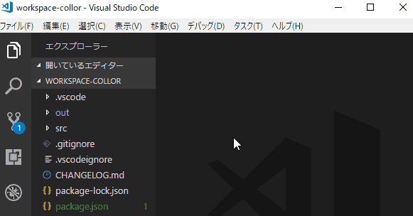

# Workspace Color

Easily change part of Color theme for Workspace setting.

## Features

## Extension Settings

This extension contributes the following settings:

- `workspaceColor.targetTheme`: default `activityBar.background` [Color Theme](https://code.visualstudio.com/docs/getstarted/theme-color-reference)
- `workspaceColor.colorList`: color list

## [Release Notes](CHANGELOG.md)

## Issues

Submit the [issues](https://github.com/atagulalan/vscode-workspace-collor/issues) if you find any bug or have any suggestion.

## Contribution

Fork the [repo](https://github.com/atagulalan/vscode-workspace-collor) and submit pull requests.
